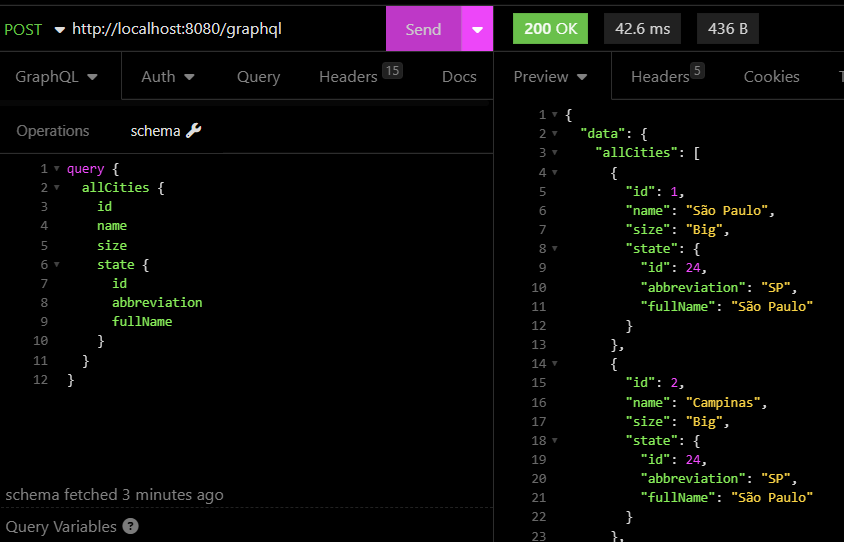

# PoC Spring Boot and GraphQL
PoC Spring Boot and GraphQL

### URLs
- [Console H2](http://localhost:8080/h2-console)
- [Console GraphQL](http://localhost:8080/graphiql?path=/graphql)

### Technologies
- Maven
- Java 11
- Lombok
- Spring Boot 3.0.1
- H2 DataBase
- Spring GraphQL

### Examples
```
curl --request POST \
  --url http://localhost:8080/graphql \
  --header 'accept: application/json, multipart/mixed' \
  --header 'content-type: application/json' \
  --data '{"query":"query {\n  allCities {\n    id\n    name\n    size\n    state {\n      id\n      abbreviation\n      fullName\n    }\n  }\n}"}'
```

